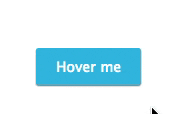

react-hint
==========
**react-hint** is a small tooltip component for [React](https://github.com/facebook/react) which is developed with simplicity and performance in mind. It doesn't include any fancy stuff, but it gets the job done. It also plays nicely with [Preact](https://github.com/developit/preact).



How to install
--------------
```
npm i -S react-hint
```

How to use
----------
```jsx
import React from 'react'
import {render} from 'react-dom'
import ReactHint from 'react-hint'
import 'react-hint/css/index.css'

const Demo = () =>
	<div>
		<button data-rh="Hint">Default</button>
		<button data-rh="Hint" data-rh-at="top">Top</button>
		<button data-rh="Hint" data-rh-at="left">Left</button>
		<button data-rh="Hint" data-rh-at="right">Right</button>
		<button data-rh="Hint" data-rh-at="bottom">Bottom</button>
		<ReactHint />
	</div>

render(<Demo />, document.getElementById('demo'))
```

How to rerender
---------------
**react-hint** uses [shouldComponentUpdate](https://facebook.github.io/react/docs/component-specs.html#updating-shouldcomponentupdate) under the hood to decide if it needs to be updated. You can use `ReactHint.instance.forceUpdate()` in case you want to force an update.

License
-------
MIT